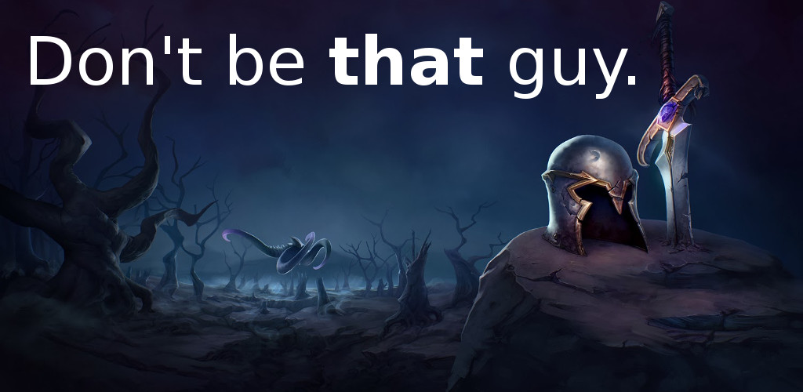

# Teamward: League Of Legends game statistics
> This is the client component. The server is [here](https://github.com/neamar/teamward-server).

Get information about your current games:

* Champions you're facing
* Champions mastery score
* Summoner rank
* Is it his main champ?
* Premade information
* Matchup statistics
* And more!

TeamWard isn't endorsed by Riot Games and doesn't reflect the views or opinions of Riot Games or anyone officially involved in producing or managing League of Legends. League of Legends and Riot Games are trademarks or registered trademarks of Riot Games, Inc. League of Legends © Riot Games, Inc.

For more information about TeamWard, please visit https://github.com/neamar/teamward-server
